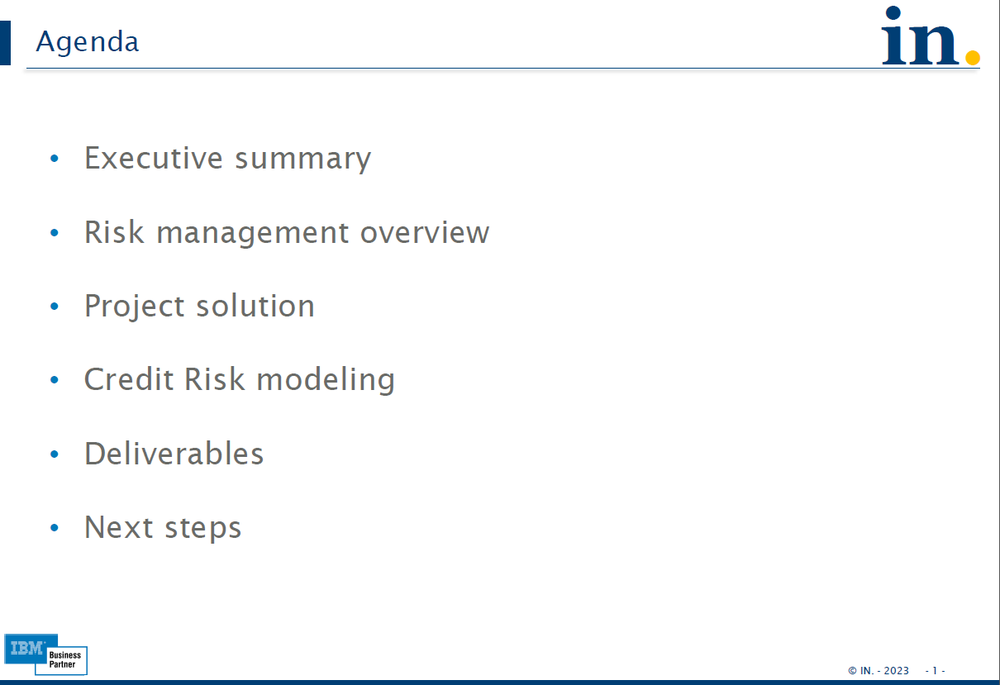
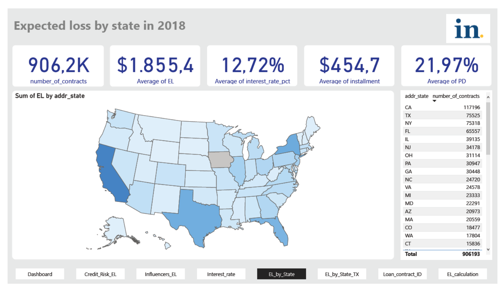

## Credit risk modeling

##### Introduction 

Credit risk modeling is an essential component of the lending process for banks and other financial institutions, as it helps to determine the creditworthiness of borrowers, the risk of default, and the appropriate level of interest rates to charge. Credit risk modeling is the process of assessing the likelihood of a borrower defaulting on a loan or failing to repay debt. 

In recent years, there has been a growing interest in using machine learning and artificial intelligence (AI) techniques to improve credit risk modeling. These techniques can analyze large datasets and identify patterns that may not be evident in traditional statistical models, leading to more accurate risk assessments and better lending decisions.

Overall, credit risk modeling plays a crucial role in the financial industry, helping lenders to assess the risk of default and make informed decisions about lending to specific borrowers. As the financial industry continues to evolve and new technologies emerge, credit risk modeling will continue to be an essential component of the lending process.

<b> Quick review how to calculate the expected loss (EL) </b>

Expected Loss (EL) is the amount of money a lender can expect to lose on average over the life of a loan due to default. It takes into account the probability of default, the exposure at default, and the loss given default. Here's how to calculate the Expected Loss:

`EL = PD x LGD x EAD`

Where:
- PD = Probability of Default: the likelihood that the borrower will default on the loan during the life of the loan.
    - `Machine Learning model (classification problem) with a PD of 10%`
- LGD = Loss Given Default: the amount of money the lender expects to lose if the borrower defaults on the loan.
    - `LDG = (Total exposure - Recoveries) / Total exposure = (USD 100,000 - USD 20,000) / USD 100,000 = 80\% `
- EAD = Exposure at Default: the amount of money the lender is exposed to when the borrower defaults on the loan.
    - `EAD = Total exposure x (1 - Recovery rate) = USD 100,000 x (1 - 0.20) = USD 80,000`
    - The recovery rate of current loan is going to be calculated with GBM model - recovery rate (regression problem)

To calculate the Expected Loss, you need to estimate each of these components based on historical data.

For example, suppose a lender has a USD 100,000 loan to a borrower with a probability of default of 10\%, a loss given default of 80\%, and an exposure at default of USD 80,000. The Expected Loss with formulas and number above, would be:

`EL (result) = 10% x 80% x $80,000 = $6,400`

This means that the lender can expect to lose USD 6,400 on average over the life of the loan due to default. The Expected Loss is an important metric for lenders because it helps them estimate the amount of risk they are taking on and set appropriate loan pricing and risk management strategies.

#### Agenda and project solution

To better understand credit risk modeling using machine learning, [check out project solution document](./doc/Credit_Risk_Modeling__project_solution.pdf). This document outlines the project's agenda, including the design and implementation of a credit risk model. It also includes details on how the project team overcame challenges and achieved success in improving credit risk management.

#### Credit Risk Modeling - Dashboard and Reports
To see an example of the results of the data pipeline process, advanced analytics with machine learning, and business intelligence in action, [click here to view Credit risk modeling - Dashboard and reports](./doc/Credit_Risk_Modeling_dashboard.pdf). This showcases how these techniques can be used to improve credit risk mitigation and drive business success, providing valuable insights with one example below.

* * *
###### Credit risk modeling notebooks 
[click here to view the notebooks](./bin/)

<b> Notes </b>
- All code and documents are available under bin/, HTML viewer and doc/ directories
