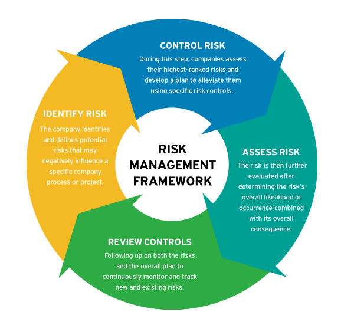

# Risk Management

The purpose of this repo is to demonstrate a <b> financial modeling project that explains Risk Management </b> in a simplified manner, from its design and conception, and finally providing a roadmap for achieving the best possible results.

##### Introduction

Risk management is the process of identifying, assessing, and mitigating risks that may affect an organization's objectives. It is a critical part of any business strategy as it helps organizations to anticipate and prepare for potential risks, minimize their impact, and take advantage of potential opportunities.

Effective risk management can help organizations to avoid or minimize potential losses, protect their reputation, and take advantage of new opportunities. It is an essential part of any organization's strategy for achieving its objectives and ensuring its long-term success.

### Types of Risk Management examples

There are several types of risk management that can be applied in different contexts and sectors. Here are some types of risk management

- <b>Strategic risk management</b>: involves the identification and control of strategic risks such as market changes, political changes, and technological changes. The goal is to ensure that a company is prepared to deal with changes in the environment in which it operates.

- <b> Financial risk management </b>: involves the identification and control of financial risks such as <b>credit risk</b>, market risk, liquidity risk, and operational risk. The goal is to minimize the impact of these risks on a company's finances. 

- <b>Compliance risk managemen</b>t: involves the identification and control of risks of non-compliance with laws, regulations, and standards such as fine risks, legal action risks, and reputation risks. The goal is to ensure that a company is in compliance with applicable regulations.

- <b>Project risk management</b>: involves the identification and control of risks in projects such as schedule risks, cost risks, quality risks, and scope risks. The goal is to ensure project success.

	- 	Quick note: PMBOK (Project Management Body of Knowledge) includes a dedicated chapter on project risk management that outlines the processes involved in identifying and managing project risks. These processes include risk identification, risk analysis, risk response planning, risk monitoring and control.

In summary, risk management involves the identification, evaluation, and control of risks that may affect a company or organization. Each type of risk management may require different strategies and tools to be effective.

Regarding <b> financial risk management </b>, you can find more details about credit risk in [Credit Risk Modeling section](./Credit_Risk_Modeling/). Understanding credit risk and all processess involved can help you better manage financial risk and make informed decisions regarding credit. Follow the link to learn more about financial risk management with credit risk.

* * *
### Overview - Risk Management framework

Risk management is an ongoing process, and organizations must continually monitor and reassess the risks they face. They must also review and update their risk management plans as circumstances change and new risks emerge.

